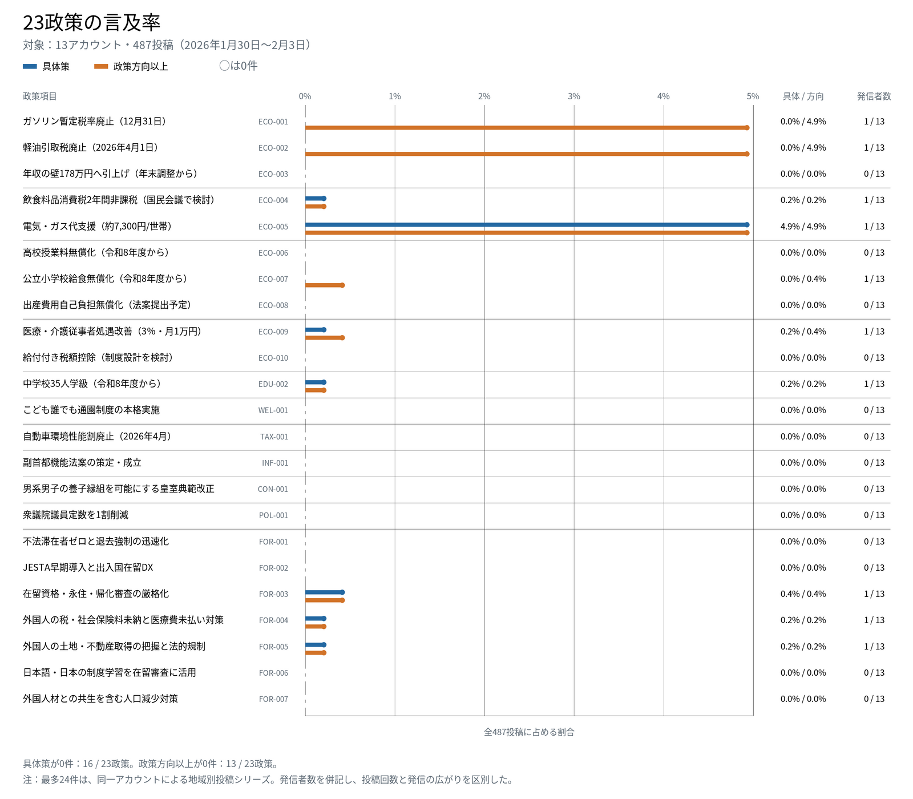

# MVP分析結果

## この分析が問うこと

党が公約として掲げた政策は、候補者名義のアカウントから、選挙期間中にどの程度提示されたのか。本MVPはこの問いを、自由民主党の公約から事前に選定した23項目と、公式候補者ページにXリンクが掲載された解散時閣僚13アカウントの投稿で検証した。

ここで測るのは、投稿の反響や到達量ではない。候補者アカウント群が、公約を周知するための発信をどの程度行ったかを、投稿本文に現れた言及の量・具体性・発信者の広がりから観察する。候補者本人の内心、投稿を誰が作成したか、実際に有権者へどれだけ届いたかは判定しない。

## 結果の要約

対象期間の487投稿のうち、事前に選定した23政策の具体策まで確認できた投稿は31件（6.4%）だった。23政策中、具体策への言及があったのは7政策で、16政策では確認できなかった。

言及は政策間・発信者間で均等ではなかった。具体策を含む31投稿のうち24投稿は「電気・ガス代支援」に関する同一アカウントの地域別投稿シリーズであり、具体策を含む投稿の80.6%（25件）は1アカウントから発信された。具体策を発信したのは13アカウント中4アカウントだった。

この結果は、選定23項目の具体策が対象範囲のX本文で限られ、一部の政策とアカウントに集中していたことを示す。党や候補者がその政策を他の媒体を含めて一切語らなかったこと、政策を実施しなかったこと、候補者本人に周知する意思がなかったことを示すものではない。

## 対象と数え方

| 項目 | 内容 |
| --- | --- |
| 対象政党 | 自由民主党 |
| 対象アカウント | 解散時閣僚のうち、公式候補者ページに本人のXリンクが掲載された13アカウント |
| 対象期間 | 2026年1月30日から2月3日まで（日本時間） |
| 分析対象 | 投稿本文を持つ通常投稿、返信、引用投稿の487件 |
| 対象外 | 単純リポスト、画像・動画内の情報、X以外の媒体、投稿の反響・到達量 |
| 公約項目 | 事前に固定した23項目（mvp_all） |

投稿本文に、公約の制度名、対象、手段、数値目標などがあり、どの項目か特定できる場合を「具体策」とした。対象と政策の方向は分かるが個別の公約項目を特定できない場合は「政策方向」、分野に触れるだけの場合は「分野のみ」とした。

主指標の「具体策言及率」は、政策ごとの具体策言及投稿数を487投稿で割った値である。「政策方向以上の言及率」は、具体策と政策方向の投稿数を同じ分母で割った値である。1投稿が複数政策に触れることがあるため、政策別の件数を合計して全投稿数と比較してはならない。

投稿の候補抽出には機械検索を用いたが、最終ラベルは487投稿を人手で全件確認して確定した。人手判定はAI提案を確認する手順で行ったもので、独立した二重符号化ではない。

## 政策別の言及状況

[SVG版を開く](assets/charts/MVP_23政策_言及率_全487投稿.svg)

図は23政策を0件の項目も含めて同じ尺度で示す。青は具体策、橙は政策方向以上の言及率で、右端は政策方向以上を発信したアカウント数である。0件を空欄にせず表示するのは、確認できなかった政策の多さ自体を結果として示すためである。

| 指標 | 結果 |
| --- | ---: |
| 分析対象投稿 | 487 |
| 選定23政策のラベルがない投稿 | 456（93.6%） |
| 具体策を含む投稿 | 31（6.4%） |
| 政策方向以上を含む投稿 | 31（6.4%） |
| 具体策の言及があった政策 | 7 / 23（30.4%） |
| 政策方向以上の言及があった政策 | 10 / 23（43.5%） |
| 分野のみを含め何らかの言及があった政策 | 11 / 23（47.8%） |
| 具体策を発信したアカウント | 4 / 13（30.8%） |

具体策の投稿数が最も多かったのは「電気・ガス代支援」の24件（4.9%）だった。次は「在留資格・永住・帰化審査の厳格化」の2件（0.4%）である。「飲食料品消費税2年間非課税」「医療・介護従事者処遇改善」「中学校35人学級」「外国人の税・社会保険料等の未納対策」「外国人の土地・不動産取得対策」は各1件（0.2%）だった。

一方、「ガソリン暫定税率廃止」と「軽油引取税廃止」は、それぞれ24投稿で価格低下の方向が示されたが、公約に記載された廃止内容そのものへの言及ではないため、全件を「政策方向」とした。この24投稿は「電気・ガス代支援」の24投稿と同じ投稿群である。政策別の件数を独立した発信量として単純に合計できない理由がここにある。

## 発信の集中をどう読むか

政策ごとの投稿数と、発信したアカウント数は別の情報である。具体策が確認できた7政策はすべて、発信者が1アカウントに限られていた。政策方向以上まで広げた10政策も同様である。投稿数が多いことは、候補者群の間で幅広く共有されたことを意味しない。

最多の24投稿は、応援先の地域に合わせて候補者名、地域名、価格、自治体施策を差し替えた一連の投稿だった。24件すべてにガソリン価格、軽油価格、電気代の記載があり、20件には都市ガス代の記載があった。ここでは、このように共通の構成と中核的な政策記述を反復し、一部を地域に合わせて変える投稿群を「地域別投稿シリーズ」と呼ぶ。

共通構成を、固有名詞と数値を伏せて模式的に示すと次のようになる。これは複数投稿の共通要素を組み合わせた説明例であり、特定の1投稿の全文引用ではない。

> 自民党公認の「〇〇」さんの応援で、〇〇県〇〇市に伺いました。  
> 〇〇県に、物価高対策をお届けします。  
> 〇ガソリン価格：〇〇円/L → 〇〇円/L  
> 〇軽油価格：〇〇円/L → 〇〇円/L  
> 〇電気代：〇〇電力で月〇〇kWh利用の場合、〇〇円から〇〇円に引き下げ  
> 〇都市ガス代：〇〇ガスで月〇〇㎥利用の場合、〇〇円から〇〇円に引き下げ  
> 〇〇県では、〇〇への支援を実施。  
> 〇〇市では、商品券の配布や公共料金の減免などを実施予定。

実際の投稿は完全に同文ではない。地域により電力・ガス会社、価格、列挙する自治体施策、文章の長さが異なる。それでも、24件を「24種類の異なる政策メッセージ」とみなすことはできない。主指標では投稿として24件を数え、図では発信アカウント数を併記することで、この二つの読み方を分けた。

## 何が言え、何が言えないか

### 観測されたこと

選定23政策のうち、具体策まで確認できたのは7政策だった。過半数の13政策では政策方向以上の言及を確認できなかった。確認できた具体策も、アカウントを横断して広く発信されたというより、特定アカウントの集中的な発信として現れた。

選挙で有権者への便益を説明しやすいと考えられる家計負担軽減、教育、子育て、社会保障の項目にも、0件または少数が多い。このため、対立を招きそうな政策だけが避けられたという説明だけでは、今回の分布を十分に説明できない。

### 周知行動の指標として

「候補者に公約を周知する気があったか」を直接測ることはできない。投稿の作成者や候補者の内心はデータに含まれないためである。

ただし、候補者名義のアカウントに具体的な公約言及が現れることは、公約を周知するための発信行動の一つの観察可能な痕跡である。本分析では、その痕跡が対象範囲でどの程度確認できたかを測る。したがって、言及度は周知意欲そのものではなく、周知行動の観察指標として扱う。

### この分析の外にあること

本分析が直接示すのは、事前に選定した23項目が、対象13アカウントのX本文にどの程度現れたかである。456投稿は「政策について何も語っていない投稿」ではなく、正確には「選定23項目への対応する言及を確認できなかった投稿」である。

全公約を同じ単位・同じ基準で符号化していないため、選定23項目が全公約より多く、または少なく発信されたとは結論づけられない。全投稿を確認した著者の印象として、対象外の公約への具体的な言及が大量にあったようには見えなかったとしても、これは体系的な比較結果ではなく、集計の結論には用いない。

また、本分析は到達量や反響を評価しない。リポスト数、いいね数、インプレッションは、アカウント規模、推薦アルゴリズム、投稿時刻、話題性などの影響を受けるため、政策言及の集計指標には含めない。測っているのは、何人に届いたかではなく、候補者アカウント群が何を投稿本文として提示したかである。

## 分析者の位置と媒体の範囲

著者はXアカウントを持たず、日常的な利用者として対象投稿をタイムラインで閲覧していない。X APIで取得した投稿を時系列のデータとして一覧化し、本文を全件確認した。そのため、個人のフォロー関係や推薦タイムラインから受ける印象には依存しない。

一方で、実際の利用画面における投稿の目立ち方、画像・動画を含む受け取られ方、返信・引用の文脈、利用者がどの投稿へ接触したかは評価していない。本分析は、X利用者の経験や世論の雰囲気を扱うものではなく、公式アカウント群から出力された投稿本文の内容分析である。

対象をXに限ったのは、費用と作業時間を考慮したMVPの範囲設定である。Facebook、Instagram、YouTube、TikTokなどを含まないため、本結果を候補者の全媒体での発信へ一般化しない。取得処理と後段の分析処理は分離しており、別媒体を分析する場合は、各サービスの規約と取得方法に従って投稿データを所定の形式へ変換すれば、政策分割、候補抽出、人手判定、集計の手順を再利用できる。

## 再現と公開データ

公開用の政策別集計は[data/mvp_policy_summary_2026.csv](data/mvp_policy_summary_2026.csv)、全体集計は[data/mvp_analysis_summary_2026.json](data/mvp_analysis_summary_2026.json)に保存している。投稿本文、APIレスポンス、作業用レビュー表は公開しない。

集計は次のコマンドで再生成できる。

    python3 scripts/summarize_mvp_results.py
    python3 scripts/render_mvp_policy_chart.py

政策セット、ラベル定義、対象期間、投稿採否の詳細は[分析設計書_MVP.md](分析設計書_MVP.md)と[config/analysis_mvp_2026.json](config/analysis_mvp_2026.json)に記録している。
