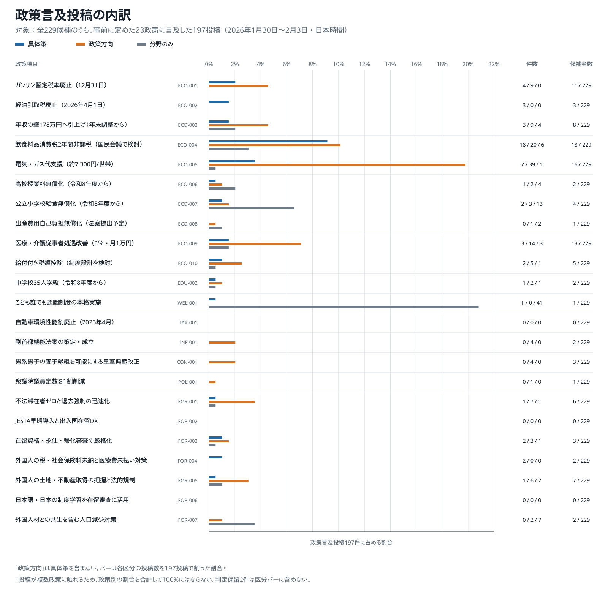

# 全候補者の政策言及：集計の読み方

## まず結論

全229候補の7,758投稿から、事前に固定した23政策のいずれかへの言及が確認できた197投稿を取り出し、その内訳を見た。これは候補者全体がどの政策をどれだけ重視しているかを直接測るものではなく、対象期間の候補者名義X投稿に現れた、23政策についての発信の構成を示す。

197投稿は74候補から発信された。197投稿の中には複数政策に触れるものがあるため、政策ラベルの件数は271件であり、投稿数とは一致しない。

## 図：政策言及投稿の内訳

[SVG版を開く](assets/charts/全候補者_23政策_政策言及内訳_197投稿.svg)

この図の分母は全7,758投稿ではなく、23政策のいずれかに言及した197投稿である。青の「具体策」は制度名、対象、手段、数値目標などから個別の公約項目を特定できる言及、橙の「政策方向」は項目に対応する方向性が分かるが具体策には至らない言及、灰色の「分野のみ」は分野に触れるだけの言及である。

「政策方向」は具体策を含まない。右端の人数は、具体策または政策方向を発信した候補者数であり、投稿回数と候補者間の広がりを分けて見るために併記している。

## 数の整理

| 何を数えたか | 件数 | 読み方 |
| --- | ---: | --- |
| 分析対象の候補者 | 229人 | 公式候補者ページのXリンクを基に対象化したアカウント数 |
| 分析対象の投稿 | 7,758件 | 通常投稿・返信・引用投稿。単純リポストは除外 |
| 23政策への言及があった投稿 | 197件 | このノートと図の分母 |
| 政策言及を発信した候補者 | 74人 | 197投稿の発信者。残る155人については、今回の期間・23政策の範囲で該当投稿を確認できなかった |
| 具体策を含む投稿 | 39件 | 投稿単位。複数政策への言及があっても1投稿として数える |
| 政策方向以上を含む投稿 | 145件 | 具体策または政策方向を少なくとも一つ含む投稿 |
| 分野のみを含む投稿 | 79件 | 他の区分も併記されうる |
| 政策ラベル | 271件 | 1投稿が複数政策に触れるため、197件より多い |

政策ラベル271件の内訳は、具体策51件、政策方向131件、分野のみ87件、判定保留2件である。図の棒は、判定保留を除く三つの区分を政策別に示す。

## 読むときの注意

- 図で割合が高いことは、全投稿に占める発信頻度が高いことではなく、政策に触れた投稿の中でその項目が多く現れたことを意味する。
- 1件の投稿に複数政策を付けられるので、政策別の割合を合計して100%にはならない。
- 投稿数が多くても、少数候補による反復投稿である可能性がある。右端の候補者数を併せて読む。
- 本集計は投稿本文を対象にする。画像・動画内の情報、他媒体での発信、反響や到達量、候補者本人の内心は測っていない。

## 判定と再現の範囲

候補抽出には機械検索を用いたが、最終ラベルは研究者が定義したパターン表に沿って全7,758投稿を人手確認した結果である。AI提案、人手ラベル、研究者ルール、集計、ここでの解釈は別々に保存している。このノートは、人手確認済みラベルの匿名集計を読みやすく提示するものであり、パターン表だけで自動判定した結果ではない。

元の集計CSVは変更していない。図は `data/all_candidates_policy_summary_2026.csv` から再生成でき、投稿本文、アカウント識別子、投稿単位の判定表は公開対象に含めない。
